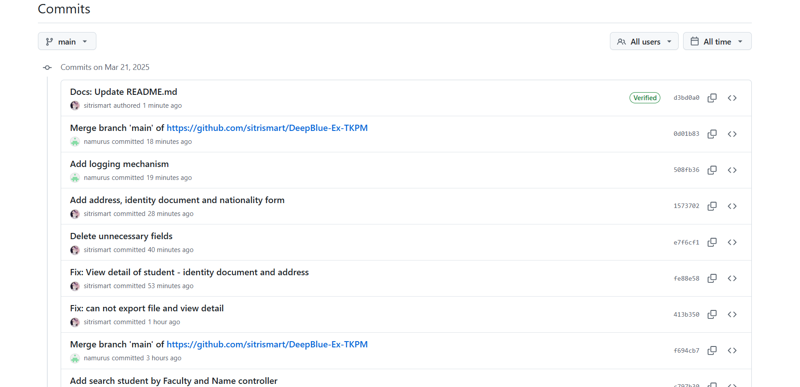

# DeepBlue-Ex-TKPM
## Hướng dẫn sử dụng **Version 1.0**
### Cấu trúc source code
```
Mô hình sử dụng: Mô hình MVC

DeepBlue-Ex-TKPM/
├── src/
│   ├── config/         Các tệp cấu hình
│   ├── controllers/    Viết logic backend cho ứng (API)
│   ├── models/         Chứa model cho Student
│   ├── routes/         Cài đặt các route cho chương trình (Định tuyến API)
│   ├── seeders/        Dữ liệu mẫu khởi tạo cho cơ sở dữ liệu
│   ├── services/       Các dịch vụ để xử lý trên Database MongoDB
│   ├── views/          Chứa giao diện của ứng dụng
│   └── server.js       File chính khởi động server
├── .babelrc
├── .env                Chứa biến môi trường
├── .env.example        File .env mẫu
├── package-lock.json
├── package.json
└── README.md           Tài liệu hướng dẫn của project
```

### Hướng dẫn cài đặt & chạy chương trình
- Mở terminal và chạy lệnh `npm install` để cài đặt tất cả các package từ package.json:
```
npm install
```
- Sau khi tải xong, dùng lệnh `npm start` để chạy chương trình:
```
npm start
```
- Chương trình web sẽ được host local tại port theo cài đặt trong file .env, ví dụ:
```
http://localhost:5134/get-create-student
```

### Biên dịch (tùy theo ngôn ngữ sử dụng)
- Sử dụng lệnh `npm install` và `npm start`, ngoài ra không cần biên dịch gì thêm.

### Chạy chương trình
- Chạy chương trình bằng lệnh `npm start` trong terminal
- Truy cập trang web tại http://localhost:[PORT]/get-student
- Có thể truy cập trang web đã được host tại link https://deepblue-ex-tkpm.onrender.com/get-student

### Tạo Tag Phiên Bản `v1.0` 

## Hướng dẫn sử dụng **Version 2.0**

### Hướng dẫn cài đặt & chạy chương trình
- Mở terminal và chạy lệnh `npm install` để cài đặt tất cả các package từ package.json:
```
npm install
```
- Sau khi tải xong, dùng lệnh `npm start` để chạy chương trình:
```
npm start
```
- Chương trình web sẽ được host local tại port theo cài đặt trong file .env, ví dụ:
```
http://localhost:5134/get-create-student
```
- Có thể truy cập trang web đã được host tại link:
```
https://deepblue-ex-tkpm.onrender.com/get-student
```

### Minh chứng các tính năng:
- Mỗi commit phải gắn với một task/subtask cụ thể  

- Cho phép đổi tên & thêm mới: khoa, tình trạng sinh viên, chương trình  

- Thêm chức năng tìm kiếm:  tìm theo khoa, khoa + tên  

- Hỗ trợ import/export dữ liệu: CSV, JSON, XML, Excel (chọn ít nhất 2)  

- Thêm logging mechanism để troubleshooting production issue & audit purposes  


### Tạo Tag Phiên Bản `v2.0`

